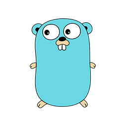

# Example API REST in GO

> The implementation using [ECHO web framework](https://echo.labstack.com/)

## Install "GO"

- For MAC: [go/MAC](https://dl.google.com/go/go1.14.darwin-amd64.pkg)

- For Windows: [go/Windows](https://dl.google.com/go/go1.14.windows-amd64.msi)

- For Linux: [go/Linux](https://dl.google.com/go/go1.14.linux-amd64.tar.gz)

## How do I use

- Clone repository

- Install modules and dependencies.

```go
 go mod download
```

- Run app.

```go
 go run src/main.go
```

- Application Debugging for VSCODE.<br/>
  Install extension [golang](ms-vscode.go) for VSCODE.
  In [launch.json](https://github.com/dev-jpnobrega/api-rest/blob/feature/add-readme-infos/.vscode/launch.json) set your envs.
  Click F5 and add your breakpoints


Go to the container folder you want to use.
Change envs, if necessary.

Example
```cmd
  cd ./redis
```

After, build your containers
```cmd
  docker-compose up
```


## Packages structure

- Package Domain

  > The domain package is responsible by business rules. The Domain decouple logic business rules of the infrastructure

  **Code structure**

  |   Folder   |        Responsibility          | 
  |------------|--------------------------------|
  |  /command  |                                |
  |  /entity   |                                |
  |  /contract |                                |
  |  /service  |                                |
    
- Package Infrastructure

  > The infrastructure package stores

  **Code structure**

  |   Folder     |        Responsibility          | 
  |--------------|--------------------------------|
  |  /factory    |                                |
  |  /http       |                                |
  |  /repository |                                |
  |  /service    |                                |


